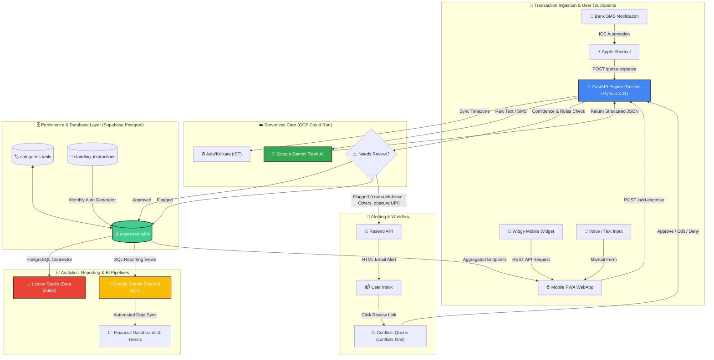

# 🧾 SmartExpenseTracker (Ledger)

> An automated, serverless, AI-powered personal expense tracking engine hosted on **GCP Cloud Run**. Seamlessly captures transactions via iOS Bank SMS Automations, Apple Shortcuts, home-screen Widgy widgets, and a custom PWA UI—powered by **Google Gemini Flash** AI parsing, **Supabase PostgreSQL**, **Looker Studio**, and **Google Sheets**.

---

## 🏗️ End-to-End System Architecture

The diagram below showcases how transactions flow automatically from payment notifications to real-time analytics, automated conflict review queues, and external BI tools:

---

## ✨ System Showcase & Key Engineering Highlights

### ☁️ GCP Cloud Run Serverless Architecture
- **Migrated from Railway to Google Cloud Run**: Re-architected as a lightweight, containerized microservice deployed via Docker on GCP Cloud Run.
- **Sub-Second Cold Starts & Zero Cost**: Scales down to 0 instances when idle, achieving sub-second response times on demand while staying entirely within GCP free tier limits.
- **Native IST Timezone Alignment**: Configured with `TZ="Asia/Kolkata"` within the container (`Dockerfile`), ensuring all transaction timestamps, daily totals, and standing instructions accurately align with Indian Standard Time (IST).

---

### 🤖 Gemini Flash AI Engine for Unstructured SMS & Text
- **Automated Text Extraction**: Raw transaction alerts (e.g. *"Paid Rs 450 to Zomato via UPI Ref 42938..."*) are parsed using `gemini-flash-latest` into structured JSON parameters: `amount`, `payee/merchant`, `payment_type` (`debit`/`credit`), and `category`.
- **Merchant Normalization**: Strips out noise like raw UPI handles, transaction reference numbers, and VPA strings to produce clean, categorized expense records.

---

### ⚠️ Automated Conflict Detection & Email Review Workflow
- **Safety Net**: To prevent incorrect category tagging or ambiguous entries, transactions are automatically assigned `status = 'pending_review'` if:
  - Gemini confidence score is below 80% (`ai_confidence < 0.80`).
  - Categorized under generic `"Others"`.
  - Payee handle is obscure (e.g. raw vendor IDs like `SRI SAI DREAM C`).
- **Instant Email Alerts**: Powered by **Resend API**, an HTML notification email is dispatched immediately upon flagging.
- **Dedicated Review Web UI**: Users can review pending items on `conflicts.html`, performing one-click **Approve**, **Edit & Approve**, or **Deny/Delete** actions.

---

### 📲 Apple Ecosystem, Widgy iOS Widget & PWA Front-End
- **Zero-Touch iOS Automation**: Incoming bank SMS notifications trigger background Apple Shortcuts that forward raw text directly to the Cloud Run `/parse-expense` endpoint.
- **Widgy Home-Screen Widget**: Custom iOS Widgy widget queries Cloud Run APIs to present daily budget burn rates, monthly totals, and recent transaction tapes on the iPhone home screen.
- **Custom Mobile PWA**: Built with Vanilla HTML5/CSS3/JS featuring a custom receipt-styled UI, native iOS safe-area notch support, standalone app mode, and dark mode aesthetics.

---

### 📅 Automated Standing Instructions Engine
- **Fixed Monthly Expenses**: Manages recurring bills, SIP investments, rent, and subscriptions.
- **Smart Generator**: Evaluates active instructions per billing cycle and inserts recurring transactions automatically with status `approved`, ensuring no fixed bill is missed.

---

### 📊 BI Dashboards: Looker Studio & Google Sheets Export
- **Google Looker Studio (Data Studio)**: Connected directly to Supabase PostgreSQL using pre-built SQL analytical views:
  - `monthly_category_summary`: Categorical spend breakdown.
  - `monthly_fixed_vs_variable`: Fixed vs. variable expense ratios.
  - `expenses_flat`: Formatted transaction log optimized for Looker charts.
- **Google Sheets Automated Export**: Syncs raw transaction logs and summary metrics directly into Google Sheets for custom formulas, scenario planning, and offline record keeping.

---

## 🛠️ Tech Stack Overview

- **Cloud Infrastructure**: Google Cloud Platform (GCP Cloud Run)
- **Containerization**: Docker (Python 3.11 slim image, Uvicorn)
- **Backend API**: FastAPI (Python), Async HTTPX
- **AI / LLM Engine**: Google GenAI SDK (`gemini-flash-latest`)
- **Database**: Supabase PostgreSQL (SQL triggers, RLS, analytical views)
- **Notifications**: Resend Email API
- **Mobile Integration**: Apple Shortcuts, Widgy Widget (iOS)
- **Frontend WebApp**: Mobile-first PWA (HTML5, Vanilla CSS Design System, JavaScript)
- **Analytics & BI**: Google Looker Studio, Google Sheets Export Pipeline
